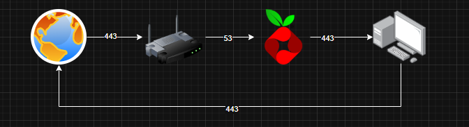

# PI-Hole
O Pi-hole é um software de bloqueio de anúncios e um poderoso serviço de DNS local que ajuda a auditar os domínios consultados em sua rede.
Caso vc utilize o pi-hole recomendo não qualquer serviço que utilize a porta 53(k3s), ja que a porta de comunicação do roteador ao pi-hole.

# configurações

Para configuração do PI-Hole no servidor e bem simples, rode o script [ajuste_porta](./scripts/ajuste_porta53.sh) para configurar a Porta 53 para PI-Hole ter as informações.
Apois isso subo o container do PI-Holee.
Para acessar o PI-Hole basta informa o IP da maquina com "/admin".
> [!TIP]
> **Para alteração da senha do PI-Hole basta executar seguintes comandos**
> ```bash 
> docker exec -it pihole sudo pihole setpassword
> ```

Para que todo trafego de internet seja verificado e possa impedir o acesso de ADs, devemos configurar o nosso moldem para que aponte para nosso servidor.
Dentro do seu moldem procure por DHCP, a configurações são bem basicas
- listamos o DHCP para encontrar endereço MAC e o ip do nosso servidor
- Reservamos o endereço para que o IP do servidor não se altere caso seja desligado.
- Por ultimo na configurações setamos o "Servidor DNS" com ip da do sevidor do PI-Hole
> [!TIP]
> DNS Secundario e importante configurar com IP do GOOGLE(8.8.8.8), se caso o servidor tenha queda a internet não caia junto.
- Após isso so reiniciar o Moldem que esta configurado o PI-Hole